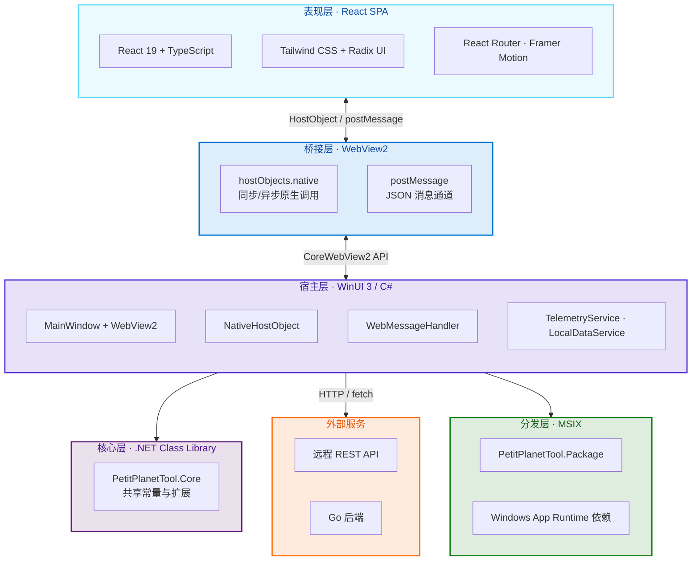
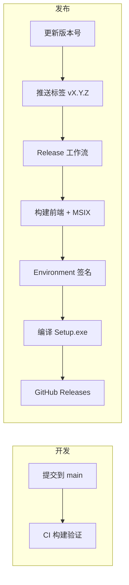

<div align="center">

# PetitPlanetTool

**React + Vite 前端 · WinUI 3 原生壳 · WebView2 桥接 · MSIX**

[](https://www.microsoft.com/windows)
[](https://dotnet.microsoft.com/)
[](https://react.dev/)
[](https://vite.dev/)
[](https://www.typescriptlang.org/)
[](https://learn.microsoft.com/windows/apps/winui/winui3/)
[](https://developer.microsoft.com/microsoft-edge/webview2/)

<br />

[](https://skillicons.dev)

</div>

---

## 项目简介

星布谷地Wiki 是一款 **混合架构 Windows 应用**：前端使用 React + Vite 构建 SPA，宿主层使用 **WinUI 3 + WebView2** 提供原生窗口与系统能力，通过 **HostObject / postMessage** 双向桥接，最终通过 **MSIX** 打包分发。

| 模式 | 前端加载方式 | 说明 |
|------|-------------|------|
| **Debug** | `http://localhost:3000` | 连接 Vite 开发服务器，支持 HMR 热更新 |
| **Release** | `https://app.local` | 虚拟主机映射本地 `Assets/Web` 静态资源 |

---

## 项目架构



**数据流向简述：**

1. 前端通过 `nativeBridge.ts` 调用 `hostObjects.native` 或发送 `postMessage`
2. C# 侧 `NativeHostObject` / `WebMessageHandler` 处理请求并调用本地服务
3. Release 构建时 MSBuild 自动将 `frontend/dist` 复制到 `Assets/Web`
4. MSIX 打包项目将宿主 exe 与依赖一并封装为 `.msix`

---

## 环境依赖与下载

### 系统要求

| 项目 | 最低版本 |
|------|---------|
| 操作系统 | Windows 10 1809 (17763) / Windows 11 |
| 架构 | x64（亦支持 x86 / ARM64 构建） |

### 开发工具

| 依赖 | 版本建议 | 下载方式 |
|------|---------|---------|
| **Visual Studio 2022** | 17.0+ | [下载 VS 2022 Community](https://visualstudio.microsoft.com/zh-hans/downloads/) |
| **.NET SDK** | 8.0+ | [下载 .NET 8 SDK](https://dotnet.microsoft.com/download/dotnet/8.0) |
| **Node.js** | 18+ (LTS) | [下载 Node.js](https://nodejs.org/) |
| **pnpm** | 10+ | `npm install -g pnpm` 或 [pnpm 安装文档](https://pnpm.io/installation) |
| **Windows 10/11 SDK** | 10.0.19041.0+ | [Windows SDK 下载](https://developer.microsoft.com/windows/downloads/windows-sdk/) |
| **Windows App SDK** | 2.2+ | [Windows App SDK 下载](https://learn.microsoft.com/windows/apps/windows-app-sdk/downloads) |
| **WebView2 Runtime** | 常青版 | [WebView2 运行时](https://developer.microsoft.com/microsoft-edge/webview2/)（开发机有 Edge 通常已满足） |

### Visual Studio 工作负载（必选组件）

在 **Visual Studio Installer → 修改** 中勾选：

- ✅ 使用 C++ 的桌面开发
- ✅ 通用 Windows 平台开发
- ✅ **MSIX 打包工具**（单个组件中搜索 "MSIX"）

### MSIX 构建工具（命令行打包）

| 工具 | 说明 |
|------|------|
| Windows SDK `makeappx.exe` | 路径示例：`C:\Program Files (x86)\Windows Kits\10\bin\10.0.28000.0\x64` |
| VS MSBuild | 路径示例：`D:\winui\MSBuild\Current\Bin\MSBuild.exe`（随 VS 安装位置而异） |

将 SDK 工具目录加入系统 `PATH` 后，可在命令行直接调用 `makeappx`。

---

## 快速开始

### 1. 克隆与安装依赖

```powershell
git clone <repository-url> PetitPlanetTool
cd PetitPlanetTool

# 前端依赖
cd frontend
pnpm install
cd ..
```

### 2. 开发模式运行

需要 **两个终端**（或使用 `scripts/dev.ps1` 启动前端）：

**终端 A — 启动前端开发服务器：**

```powershell
cd frontend
pnpm dev
# 默认 http://localhost:3000，与 appsettings 中 DevServerUrl 一致
```

**终端 B — 启动 WinUI 宿主：**

在 Visual Studio 2022 中打开 `src/PetitPlanetTool.Host/PetitPlanetTool.csproj`，选择 **Debug | x64**，按 F5 运行。

或使用一键脚本（仅启动前端，并提示 VS 操作步骤）：

```powershell
.\scripts\dev.ps1
```

> Debug 模式下 WebView2 自动打开 DevTools，前端修改即时 HMR 生效。

### 3. 生产构建

```powershell
# 构建前端产物 → frontend/dist
.\scripts\build-frontend.ps1

# 构建宿主（MSBuild 自动复制 dist → Assets/Web）
dotnet build src/PetitPlanetTool.Host/PetitPlanetTool.csproj -c Release
```

Release 模式下前端通过虚拟主机 `https://app.local/index.html` 加载本地静态文件。

### 4. MSIX 打包

**方式 A — Visual Studio（推荐）：**

1. 打开 `src/PetitPlanetTool.Package/PetitPlanetTool (Package).wapproj`
2. 设为启动项目，选择 **Release | x64**
3. 右键项目 → **发布** → 创建应用包

**方式 B — 命令行：**

```powershell
.\scripts\build-frontend.ps1

& "<VS安装路径>\MSBuild\Current\Bin\MSBuild.exe" `
  "src\PetitPlanetTool.Package\PetitPlanetTool (Package).wapproj" `
  /p:Configuration=Release /p:Platform=x64 `
  /p:AppxPackageSigningEnabled=false `
  /p:UapAppxPackageBuildMode=SideloadOnly /restore /m
```

输出目录：

```
src/PetitPlanetTool.Package/AppPackages/
  └── PetitPlanetTool (Package)_0.1.1.0_x64_Test/
        ├── PetitPlanetTool (Package)_0.1.1.0_x64.msix   ← 安装包
        ├── Add-AppDevPackage.ps1                         ← 侧载安装脚本
        └── Dependencies/                                 ← 框架依赖
```

侧载安装（开发者模式或管理员 PowerShell）：

```powershell
cd "src\PetitPlanetTool.Package\AppPackages\PetitPlanetTool (Package)_0.1.1.0_x64_Test"
.\Add-AppDevPackage.ps1
```

### 5. CI/CD 与发布

相关仓库：

| 仓库 | 说明 |
|------|------|
| [PetitPlanetWiki](https://github.com/PetitPlaneTool/PetitPlanetWiki) | 主代码仓库，GitHub Actions 构建签名 MSIX 与 Setup.exe |
| [certificate](https://github.com/PetitPlaneTool/certificate) | 根证书公钥 `PetitPlanetRootCA.cer`；PFX 私钥仅存 Secrets |

#### 工作流说明

| 工作流 | 文件 | 触发条件 | 作用 |
|--------|------|----------|------|
| **CI** | `.github/workflows/ci.yml` | `main` 分支推送 / Pull Request | 构建未签名 MSIX，验证工程可编译 |
| **Release** | `.github/workflows/release.yml` | 推送 `v*` 标签 / 手动运行 | 签名 MSIX + Inno Setup，发布到 GitHub Releases |



#### Secrets 配置（维护者）

签名凭据配置在 **Environment `CERTIFICATE`**（非仓库级 Secrets）：

1. 仓库 **Settings → Environments → CERTIFICATE**
2. 在 **Environment secrets** 中添加：

| Secret | 值 |
|--------|-----|
| `CERTIFICATE` | `codesign.pfx` 的 Base64 全文 |
| `PW` | PFX 导出密码 |
| `GITEE_TOKEN` | Gitee 私人令牌（用于将 MSIX 推送到国内镜像仓库 `master/releases/`） |

> Release 工作流已声明 `environment: CERTIFICATE`，否则无法读取上述 Secrets。

根证书公钥发布在 [certificate 仓库](https://github.com/PetitPlaneTool/certificate)；

#### 发布步骤

1. 在 `src/Directory.Build.props` 及 `Package.appxmanifest` 等处更新版本号
2. 提交并推送到 `main`
3. 创建并推送标签（版本号与标签一致，前缀 `v`）：

```powershell
git tag v0.1.1
git push origin main
git push origin v0.1.1
```

也可在 **Actions → Release → Run workflow** 手动触发（填写版本号如 `0.1.1`）。

#### Release 产物

| 文件 | 说明 |
|------|------|
| `PetitPlanetWiki_0.1.1.0_x64.msix` | 已签名 MSIX 安装包 |
| `PetitPlanetWikiSetup.exe` | 在线引导安装器（装证书 → 下载 MSIX） |
| `PetitPlanetWikiSetupFull.exe` | 离线完整安装器（内置 MSIX，网络失败时自动回退） |

发布页：[github.com/PetitPlaneTool/PetitPlanetWiki/releases](https://github.com/PetitPlaneTool/PetitPlanetWiki/releases)

**用户安装（推荐）：** 下载 `PetitPlanetWikiSetup.exe` 双击运行。详见 [`installer/README.md`](installer/README.md)。

#### 本地构建脚本

| 脚本 | 用途 |
|------|------|
| `scripts/dev.ps1` | 启动前端开发服务器 |
| `scripts/build-frontend.ps1` | 构建前端 `frontend/dist` |
| `scripts/build-msix.ps1` | 构建未签名 MSIX（需 MSBuild） |
| `scripts/clean-build.ps1` | 清理 `bin/`、`obj/`、`AppPackages/`、`dist/` 等 |
| `scripts/release-build.ps1` | 完整发布构建（需设置 `CERTIFICATE_BASE64` / `CERTIFICATE_PASSWORD` 环境变量） |
| `scripts/sign-msix.ps1` | 使用 PFX 对 MSIX / EXE 签名 |
| `scripts/prepare-installer.ps1` | 从 certificate 仓库下载根证书公钥 |

```powershell
.\scripts\clean-build.ps1
```

---

## 贡献与提交规范

### 分支策略

- `main`：稳定分支，CI 通过后方可合并
- 功能开发请从 `main` 拉取分支，通过 Pull Request 合并

### 提交信息

使用简洁的中文或英文说明 **做了什么、为何做**，推荐格式：

```
<type>: <简短描述>

可选的详细说明
```

| type | 含义 |
|------|------|
| `feat` | 新功能 |
| `fix` | 缺陷修复 |
| `docs` | 文档变更 |
| `chore` | 构建、脚本、配置等杂项 |
| `refactor` | 重构（不改变行为） |

示例：`feat: 添加友邻详情页筛选`、`fix: 修复 Release 工作流 Environment 读取`。

### 禁止提交的内容

以下文件/目录 **不得** 进入 Git 仓库（已在 `.gitignore` 中忽略）：

| 类别 | 示例 |
|------|------|
| 签名私钥 | `*.pfx`、`codesign.pfx.*`、`certificate/` 目录 |
| 构建产物 | `dist/`、`**/bin/`、`**/obj/`、`**/AppPackages/`、`frontend/dist/` |
| 依赖目录 | `node_modules/`、NuGet `packages/` |
| 本地配置与密钥 | `.env`、`secrets.json`、含密码的文本文件 |
| 自动生成资源 | `src/PetitPlanetTool.Host/Assets/Web/`（由构建复制） |
| 安装器临时文件 | `installer/output/`、`installer/assets/*.cer` |

提交前建议执行：

```powershell
git status
.\scripts\clean-build.ps1   # 可选：清理本地构建残留
```

### Pull Request 检查项

- [ ] 不包含私钥、密码、`.env` 等敏感信息
- [ ] 前端变更在 `frontend` 目录下可正常 `pnpm build`
- [ ] 涉及宿主/打包时，本地或 CI 构建无报错
- [ ] 版本发布类变更已同步 `Directory.Build.props` 与 `Package.appxmanifest`

---

## 项目结构

```
PetitPlanetTool/
├── frontend/                          # React + Vite 前端（独立 npm 工程）
│   ├── src/
│   │   ├── api/                       # 远程 API 客户端
│   │   ├── bridge/                    # WebView2 原生桥接封装
│   │   ├── components/                # UI 组件（含 shadcn/ui）
│   │   ├── pages/                     # 页面路由
│   │   ├── hooks/                     # React Hooks
│   │   ├── data/                      # 静态数据
│   │   └── utils/                     # 工具函数
│   ├── package.json
│   └── vite.config.ts
│
├── src/
│   ├── PetitPlanetTool.Host/          # WinUI 3 宿主（exe 入口）
│   │   ├── App.xaml[.cs]              # 应用入口与 DI 容器
│   │   ├── MainWindow.xaml[.cs]       # 主窗口 + WebView2 初始化
│   │   ├── Bridge/                    # NativeHostObject、WebMessageHandler
│   │   ├── Services/                  # 遥测、本地数据等服务
│   │   ├── Helpers/                   # 配置读取、文件路径辅助
│   │   ├── Models/                    # 数据模型
│   │   ├── Assets/Web/                # 前端构建产物（自动生成）
│   │   ├── appsettings.json           # 运行时配置
│   │   └── Properties/PublishProfiles/ # 发布配置 (win-x64 等)
│   │
│   ├── PetitPlanetTool.Core/          # 共享核心类库
│   │   └── Constants/                 # 应用常量
│   │
│   └── PetitPlanetTool.Package/       # MSIX 打包项目
│       ├── Package.appxmanifest       # 应用清单
│       └── Images/                    # 应用图标（Logo.png 及 MSIX 各尺寸资源）
│
├── docs/
│   └── 技术文档.md                     # 完整技术手册
│
├── installer/                         # Inno Setup 引导安装程序
│   ├── PetitPlanetWikiSetup.iss
│   └── install-app.ps1
│
└── scripts/
    ├── dev.ps1                        # 开发模式启动脚本
    ├── build-frontend.ps1             # 前端生产构建
    ├── build-msix.ps1                 # 构建未签名 MSIX
    ├── clean-build.ps1                # 清理构建产物
    ├── release-build.ps1              # 完整发布构建（CI 调用）
    ├── sign-msix.ps1                  # signtool 签名
    └── prepare-installer.ps1          # 下载根证书公钥（Inno Setup 用）
```

---

## 配置说明

宿主配置文件 `src/PetitPlanetTool.Host/appsettings.json`：

| 键 | 默认值 | 说明 |
|----|--------|------|
| `WebView2.DevServerUrl` | `http://localhost:3000` | Debug 模式 Vite 地址 |
| `WebView2.VirtualHostName` | `app.local` | Release 虚拟主机名 |
| `WebView2.AssetsFolder` | `Assets/Web` | 静态资源目录 |
| `ApiSettings.BaseUrl` | `https://api.myapp.com` | 远程 API 基地址 |

---

## 开源项目使用目录

本项目基于以下开源软件构建，在此致谢并列出主要依赖。完整许可证文本请参阅各项目官方仓库或 `frontend/node_modules` 中对应 `LICENSE` 文件。

### 前端依赖

| 项目 | 版本 | 许可证 | 用途 | 链接 |
|------|------|--------|------|------|
| [React](https://react.dev/) | 19.x | MIT | UI 框架 | https://github.com/facebook/react |
| [Vite](https://vite.dev/) | 7.x | MIT | 构建工具 | https://github.com/vitejs/vite |
| [TypeScript](https://www.typescriptlang.org/) | 5.9 | Apache-2.0 | 类型系统 | https://github.com/microsoft/TypeScript |
| [Tailwind CSS](https://tailwindcss.com/) | 3.4 | MIT | 样式框架 | https://github.com/tailwindlabs/tailwindcss |
| [Radix UI](https://www.radix-ui.com/) | 1.x | MIT | 无障碍 UI 原语 | https://github.com/radix-ui/primitives |
| [React Router](https://reactrouter.com/) | 7.x | MIT | 客户端路由 | https://github.com/remix-run/react-router |
| [Framer Motion](https://www.framer.com/motion/) | 12.x | MIT | 动画库 | https://github.com/motiondivision/motion |
| [Lucide React](https://lucide.dev/) | 0.56x | ISC | 图标库 | https://github.com/lucide-icons/lucide |
| [Recharts](https://recharts.org/) | 2.x | MIT | 图表组件 | https://github.com/recharts/recharts |
| [Zod](https://zod.dev/) | 4.x | MIT | 数据校验 | https://github.com/colinhacks/zod |
| [React Hook Form](https://react-hook-form.com/) | 7.x | MIT | 表单管理 | https://github.com/react-hook-form/react-hook-form |
| [pnpm](https://pnpm.io/) | 10.x | MIT | 包管理器 | https://github.com/pnpm/pnpm |

### 后端 / 宿主依赖

| 项目 | 版本 | 许可证 | 用途 | 链接 |
|------|------|--------|------|------|
| [.NET](https://dotnet.microsoft.com/) | 8.0 | MIT | 运行时与 SDK | https://github.com/dotnet/core |
| [Windows App SDK / WinUI 3](https://learn.microsoft.com/windows/apps/windows-app-sdk/) | 2.2 | 微软软件许可 | 原生 UI 框架 | https://github.com/microsoft/WindowsAppSDK |
| [WebView2](https://developer.microsoft.com/microsoft-edge/webview2/) | 1.0.3719 | 微软软件许可 | 嵌入式浏览器 | https://github.com/MicrosoftEdge/WebView2Feedback |
| [Microsoft.Extensions.*](https://learn.microsoft.com/dotnet/core/extensions/) | 8.0 | MIT | 配置与 DI | https://github.com/dotnet/runtime |
| [System.Text.Json](https://learn.microsoft.com/dotnet/standard/serialization/system-text-json-overview) | 8.0 | MIT | JSON 序列化 | https://github.com/dotnet/runtime |

### 查看完整第三方许可证

```powershell
# 前端全部依赖许可证（需先 pnpm install）
cd frontend
pnpm licenses list

# 或查看 NuGet 包许可证
dotnet list src/PetitPlanetTool.Host/PetitPlanetTool.csproj package --include-transitive
```

---

## 相关文档

| 文档 | 说明 |
|------|------|
| [WinUI 3 文档](https://learn.microsoft.com/windows/apps/winui/winui3/) | 微软官方 WinUI 指南 |
| [WebView2 文档](https://learn.microsoft.com/microsoft-edge/webview2/) | WebView2 API 参考 |
| [MSIX 打包指南](https://learn.microsoft.com/windows/msix/) | MSIX 打包与分发 |

---

<div align="center">

**PetitPlanetTool** — 星布谷地Wiki

**Lumi Games** — 露米工作室 

</div>
