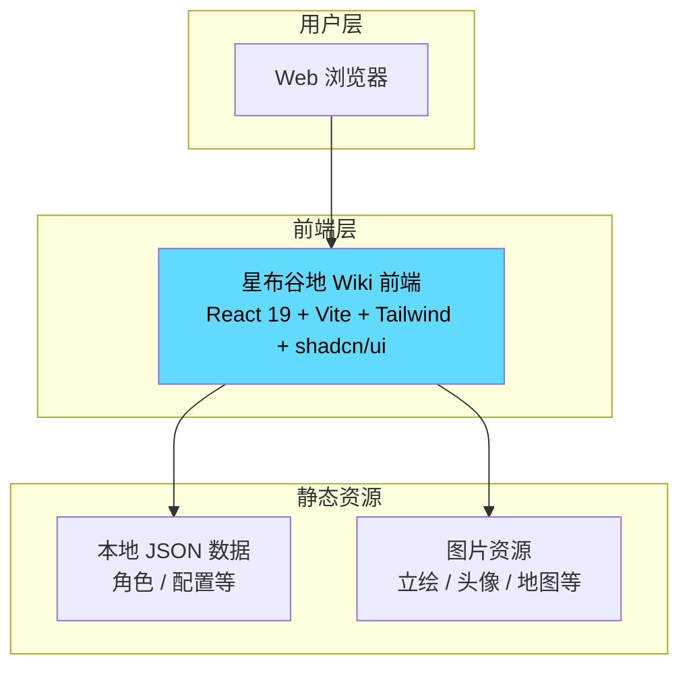
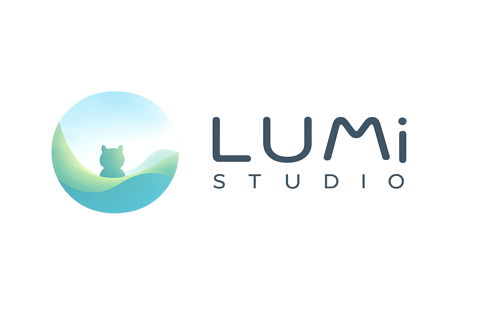

<div align="center">
  <h1>星布谷地助手</h1>
  <p>基于 React + Vite 的星布谷地 Wiki 前端</p>
</div>

<div align="center">
  
</div>

<div align="center">
  
  
  
  
</div>

---

## 项目简介

星布谷地助手是一款面向星布谷地的 Wiki，采用 React + Vite 构建

---

## 完整架构图



---

## 系统模块架构

```
星布谷地助手
|
├── 前端应用 (src/)
│   ├── React 19 + TypeScript + Vite
│   ├── Tailwind CSS + shadcn/ui 组件库
│   ├── 页面: Wiki 首页、百科模块（友邻 / 星系 / 菜肴 / 家具 / 打扮 / 昆虫 / 鱼类 / 岸边居民 / 植物 / 物品 / 装饰 / 种植 / 制作 / 音乐）、地图、截图识别、登录、个人中心、设置、反馈
│   └── 功能: 侧边栏导航、搜索、背景设置
│
├── 静态资源 (public/)
│   ├── 角色数据 JSON
│   ├── 立绘 / 头像 / 地图等图片资源
│   └── 字体文件
│
└── 构建产物 (dist/)
    └── Vite 生产构建输出
```

---

## 技术栈详情

| 层级 | 技术 | 说明 |
|------|------|------|
| **前端框架** | React 19 + TypeScript | 函数组件 + Hooks |
| **构建工具** | Vite 7 | 极速开发与构建体验 |
| **样式方案** | Tailwind CSS 3.4 + shadcn/ui | 原子化 CSS + 可复用组件库 |
| **动画** | GSAP / Framer Motion | 过渡与交互动画 |
| **图标** | Lucide React / Font Awesome | 字体图标方案 |

---

## 核心功能特性

### 1. Wiki 百科浏览
- 游戏简介（游戏概述、玩法）
- 完整百科分类：友邻、星系、菜肴、家具、打扮、昆虫、鱼类、岸边居民、植物、物品、装饰、种植、制作、音乐
- 角色卡片浏览与详情侧滑面板
- 地图展示

### 2. 界面与交互
- 可折叠侧边栏导航，支持展开/收缩两种模式
- 百科模块分组折叠
- 全局背景设置（纯色 / 图片 + 透明度调节）
- 移动端适配抽屉导航
- 所有卡片、按钮、容器采用连续曲线圆角与暖灰投影

### 3. 静态数据驱动
- 角色数据通过本地 JSON 加载
- 图片与字体资源均打包为静态文件
- 无需网络请求即可完整运行

---

## 项目目录结构

```
d:\code\PetitPlanetTool\xingbugudi/
|
├── src/                        # 前端源码
│   ├── components/             # 组件
│   │   ├── ui/                 # shadcn/ui 组件库
│   │   ├── ContentArea.tsx     # 页面路由映射
│   │   ├── Sidebar.tsx         # 桌面端侧边栏
│   │   └── MobileSidebar.tsx   # 移动端侧边栏
│   ├── pages/                  # 页面组件
│   ├── data/                   # 静态数据配置
│   ├── hooks/                  # 自定义 Hooks
│   ├── types/                  # TypeScript 类型定义
│   └── assets/                 # 前端内联资源
│
├── public/                     # 静态资源
│   ├── fonts/                  # 游戏字体文件
│   ├── images/                 # 图片资源
│   └── resources/              # 数据 JSON / 角色立绘
│
├── dist/                       # 构建产物
├── index.html
├── vite.config.ts
├── tailwind.config.js
└── package.json
```

---

## 快速启动

### 前置依赖
- Node.js 20+

### 1. 安装依赖
```bash
npm install
```

### 2. 启动开发服务器
```bash
npm run dev
```
应用将在 http://localhost:5173 运行。

### 3. 生产构建
```bash
npm run build
```

---

## 开发

<p align="center" style="color: #bee453;">LUMI STUDIO</p>

<div align="center">
  
</div>
